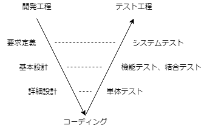

## 第２章 ソフトウェア開発の流れとテスト工程
### 2.1 開発工程とテスト工程
#### V字モデル
ソフトウェア開発（ウォータフォール）の上流の各開発工程に対応させてテスト工程を分割したモデル

#### W字モデル
開発の初期段階からテスト工程を並行して進めるモデル

### 2.2 テストの分類
代表的なテストを以下の3軸で分類

#### 「ソフトウェアの内部構造に注目する/しない」による分類
- ホワイトボックステスト
  - 内部の論理構造に注目して、処理や分岐命令の動作、データ処理などが正しく行えているか確認するテスト
- ブラックボックステスト
  - 内部の論理構造には注目せず、入力と出力のみに着目してソフトウェアが正しく動作するか確認するテスト
#### 「ソフトウェアを動作させる/させない」による分類
- 静的テスト
  - 開発仕様書やビルド前のソースコードの状態で確認するテスト
  - 通常開発工程で実施
- 動的テスト
  - 実際に動作させて正しく動作するか確認するテスト
  - 通常テスト工程で実施
#### 「ソフトウェア開発の工程」による分類
- 開発工程
  - 主にレビューを実施
- テスト工程
  - 「ソフトウェアテスト」と呼ぶ

#### テストの概要
- 開発工程で行うテスト

  | 種類 | 説明 |
  | - | - |
  | インスペクション | プロセス、ルール、役割分担が明確。公式記録として残すべき重要度の高い文書に適したレビュー。 |
  | テクニカルレビュー | 専門知識を持つレビュアーにより技術的な問題を確認。あらかじめ決められたレビュープロセスがある。 |
  | 非公式レビュー | 特に決まった方式はない。レビュアーが1人の時 = **ペアレビュー** |
  | ウォークスルー | 作成者が対象を説明し、レビュアーにコメントをもらう形式。 |
  | 机上デバッグ | ソースコードを目視で確認して誤り等を修正。作成者自身が実施することが多い。 |

- 単体テスト工程で行うテスト

  | 種類 | 説明 |
  | - | - |
  | 機能確認テスト | 1つのモジュールが詳細設計書や機能仕様書どおりに動作するか確認。 |
  | 制御フローテスト | プログラム論理構造に沿って**命令**・**分岐**などすべて実行可能か確認。 |
  | データフローテスト | データや変数が*定義->使用->消滅*の順に実施されているか確認。静的解析可能。 |

- 結合・機能テスト工程で行うテスト

  | 種類 | 説明 |
  | - | - |
  | 状態遷移テスト | 状態遷移図、状態遷移表に基づいて動作を確認。 |
  | 機能確認テスト | モジュール同士の連携や複数のモジュールからなる機能が詳細設計書どおりに動作するか確認。 |

- システムテスト工程で行うテスト

  | 種類 | 説明 |
  | - | - |
  | 確認テスト | テスト済みの項目を再度確認。 回帰テスト、デグレードチェックテスト、スモークテスト、リリースチェックテスト |
  | 評価テスト | 単純に○×で判断が難しい品質に対して質を判断。 セキュリティテスト、ユーザビリティテスト、障害許容性テスト |
  | 負荷テスト | 動作時に負荷をかけて確認。 性能テスト、ロングランテスト、ボリュームテスト、ストレージテスト、高頻度テスト、ストレステスト |
  | 環境テスト | プラットフォームや周辺機器に注目して確認。 構成テスト、互換性テスト、両立性テスト |
  | 機能確認テスト | ユーザの要求を満たすために、各機能が詳細設計書どおりに動作するか確認。 |
  | その他のテスト | 上記に以外の確認。 アドホックテスト、探索型テスト、リスクベーステスト |

- ユーザによるテスト

  | 種類 | 説明 |
  | - | - |
  | 受入れテスト | 受入れを判定、承認するためのユーザ要求を満たしているか公式に確認。 |
  | 運用テスト | 本番環境下で正しく動作するか確認。 |
  | アルファテスト | 試作段階の製品を開発者以外の人に操作してもらい動作を確認。 |
  | ベータテスト | リリース前に製品を一般ユーザに操作してもらい使用性や不具合がないことを確認。 |
