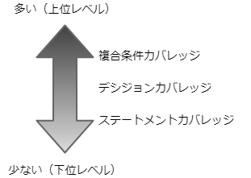

## 第3章 ホワイトボックステスト
### 1.1 ホワイトボックステスト
- ソフトウェアの中身を理解したうえでそれを意識しつつテストすること。
- ソフトウェアの最小単位であるもモジュールの1つひとつを対象とした単体テストで用いる。
- テスト実施を効率化するために **フォローチャート** や **データフロー図** などを用いて論理構造を視覚化する。
#### ホワイトボックステストの種類
- 制御フローテスト
  - 命令文の処理順序を確認
- データフローテスト
  - データの流れを確認
#### メリット
- モジュール内部の処理（命令文）単位で動作確認が可能な点
- 検出された欠陥の原因箇所がモジュール内部に限定されるため、そのモジュールを調査・変更するだけで修正を完了することが可能。
#### デメリット
- 仕様の実装漏れの検出は困難
- 採用するカバレッジレベルにもよるが工数が大きい
- モジュール単位の確認のためモジュール間の競合や動作環境によっては仕様を保証できない
### 1.2 モジュールと論理構造
- 論理構造
  - モジュール内に含まれる処理の流れや実行順序
  - 誤りがあると正常に動作しないばかりでなく他のモジュールと組み合わせると多くの問題を引き起こす
  - モジュール内の各処理に間違いはなくとも実行順序が異なればモジュール全体では問題が発生
    - このとき、**モジュールの論理構造に誤りがある** という
### 1.3 制御フローテスト
#### 実施手順
1. ソースコードをもとにフローチャートの作成
   - モジュールの論理構造を視覚化する。
2. カバレッジ基準の決定
   - 着目するカバレッジ基準（「命令文」「分岐した経路」「条件」）を選択する。
   - 基本的にはカバレッジは100%を目指す。
3. カバレッジ基準を網羅する経路を抽出
   - 選択したカバレッジ基準ををすべて満たすフローチャート上の経路を決定する。
4. 抽出した経路を通るようにテストを実施
   - 手順3で抽出した経路を通る入力値を指定してモジュールを動作させてテストを実施する。
5. 結果の確認
   - テストを実施した結果として手順3で抽出したすべての経路を通ったかを確認する。
#### カバレッジ基準
##### ステートメントカバレッジ
- **命令文** に着目した基準
- *すべての命令文* を最低1度は通るようにテスト
##### デシジョンカバレッジ（ブランチカバレッジ）
- **分岐した経路** に着目した基準
- *分岐の起点となるステートメント後のすべての経路* を最低1度は通るようにテスト
- デシジョンとは判定という意味
##### 複合カバレッジ
- **条件** に着目した基準
- *条件に含まれるすべての条件パターン* を満たすようにテスト
- AND や OR で結ばれた複合条件が設定されている際に利用可能
#### カバレッジレベルの違い
- 選択するカバレッジ基準によって以下の図のようにテスト項目数が異なる。

  

### 1.4 データフローテスト

