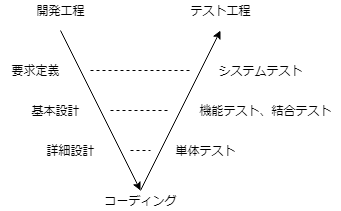
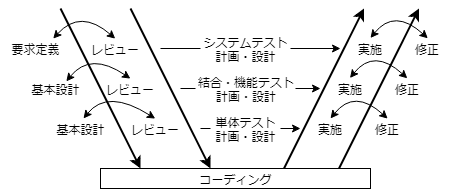

# PART1 ソフトウェアテストの基礎
## 第１章 ソフトウェアテストとは
### 1.1 ソフトウェアテスト
欠陥を取り除いて、ユーザの要求を満たす、品質の良いソフトウェアを作ること 
ソフトウェアを搭載した製品やサービスを市場に出す前に欠陥がないかテストすること
#### 欠陥
- 誤動作の原因がソフトウェアにあることが特定されたもの
- ソフトウェア作成時に人のミスによって作り込まれる
- 欠陥のないソフトウェアを作成することはほぼ不可能
#### 不具合
- 原因が特定される前の欠陥と思われる現象
### 1.2 ソフトウェアの品質
#### 品質
- *「品質とは要求を満たすことである」　※ フィリップ B.クロスビー氏*
- *「品質は誰かにとっての価値である」　※ G.M.ワインバーグ氏*
#### 品質の良いソフトウェア
- **ユーザの要求を満たし、ユーザに価値を提供するソフトウェア**
  - テスト時には以下を意識して実施する必要がある
    - ユーザの要求
    - ユーザにとっての価値
#### ISO/IEC 9126 品質特性規格
品質を以下6つの特性に分類
- 機能性（functionality）
  - 必要な機能が実装されていること
  - 合理目的性、正確性、相互運用性、セキュリティ、標準適合性
- 信頼性（reliability）
  - 昨日が正しく動作し続けられること
  - 成熟性、障害許容性、回復性、信頼性、標準適合性
- 使用性（usability）
  - 利用者に使いやすく魅力的であること
  - 理解性、習得性、運用性、魅力性、標準適合性
- 効率性（efficiency）
  - 資源の量に対比して適切な性能であること
  - 時間効率性、資源効率性、標準適合性
- 保守性（maintainability）
  - 維持、変更がしやすいこと
  - 解析性、変更性、安定性、試験性、標準適合性
- 移植性（portability）
  - 別環境に移しやすいこと
  - 環境適応性、設置性、共存性、置換性、標準適合性
### 1.3 求められる品質意識
#### Verification and Validation（検証と妥当性確認）
開発者は開発仕様書を重視して製品を見るが、テスト担当者は本見方（Verification and Validation）の視点を持つことが重要
- Verification（検証）
  - 開発仕様書の通りにソフトウェアが作成されているかを確認
- Validation（妥当性確認）
  - ユーザの要求通りにソフトウェアが作成されているかを確認
#### 品質とユーザ満足度の関係
全ユーザの満足度を満たす品質を一概に決定することはできない 
ユーザ満足度と品質の関係を示した「**狩野モデル**」が存在
- 狩野モデル

  | 品質要素 | 充足 | 不充足 |
  |----|----|----| 
  | 当たり前品質 | 当たり前 | 不満 |
  | 一元的品質 | 満足 | 不満 |
  | 魅力的品質 | 満足 | 仕方がない |

  - これらの品質は時間の経過とともに変遷

## 第２章 ソフトウェア開発の流れとテスト工程
### 開発工程とテスト工程
#### V字モデル
ソフトウェア開発（ウォータフォール）の上流の各開発工程に対応させてテスト工程を分割したモデル

#### W字モデル
開発の初期段階からテスト工程を並行して進めるモデル

### テストの分類